# 🎬 data-cleaning-analysis


An **end-to-end ELT (Extract → Load → Transform)** data engineering project that cleans, transforms, and analyzes the Netflix dataset using **Python (Pandas + SQLAlchemy)** and **Microsoft SQL Server (SSMS)**.

---
## 🏗️ Architecture



## 📌 Project Overview

| Phase | Tool Used | Description |
|-------|-----------|-------------|
| **Extract** | Python, Pandas | Read raw Netflix CSV into a DataFrame |
| **Load** | SQLAlchemy, SQL Server | Load raw data into `net_raw` table in SQL Server |
| **Transform** | SQL Server (SSMS) | Clean, deduplicate, normalize into staging tables |
| **Analyze** | T-SQL | Run business insight queries on cleaned data |

---

## 🗂️ Project Structure

```
netflix-data-cleaning-analysis/
│
├── data_extract.ipynb          # Python: Load CSV → SQL Server (ELT Extract & Load)
├── raw.sql                    # SQL: Create net_raw table schema
├── data_analysis.sql           # SQL: Data cleaning + 5 business analysis queries
└── README.md
```

## 🔧 Tech Stack

| Technology | Purpose |
|-----------|---------|
| Python 3.x | Data extraction scripting |
| Pandas | CSV reading & inspection |
| SQLAlchemy + PyODBC | Python → SQL Server connection |
| SQL Server (SSMS) | Data storage, cleaning & analysis |
| Jupyter Notebook | Interactive development environment |

---

## 📊 Dataset

- **Source:** [Kaggle – Netflix Movies and TV Shows](https://www.kaggle.com/datasets/shivamb/netflix-shows)
- **Size:** ~8,800 rows, 12 columns
- **Null values found:** director (2634), cast (825), country (831), date\_added (10), rating (4), duration (3)

---
## 🧹 Data Cleaning Steps (SQL Server)

1. **Remove duplicates** — using `ROW_NUMBER()` with `PARTITION BY title, type`
2. **Fix data types** — cast `date_added` from `VARCHAR` → `DATE`
3. **Fix duration NULLs** — replace NULL duration with rating value
4. **Normalize `listed_in`** → `net_genre` table (one genre per row via `STRING_SPLIT`)
5. **Normalize `director`** → `net_director` table
6. **Normalize `country`** → `net_country` table
7. **Normalize `cast`** → `net_cast` table
8. **Populate missing countries** — join `net_director` to infer country from same director's other titles

---

## 📈 Business Analysis Queries

| # | Question |
|---|----------|
| 1 | For each director — count of Movies vs TV Shows (directors who made both) |
| 2 | Which country has the highest number of Comedy Movies? |
| 3 | For each year, which director released the most movies on Netflix? |
| 4 | What is the average duration of movies in each genre? |
| 5 | Directors who created both Horror and Comedy movies — with counts |

---

## 🚀 How to Run

### Prerequisites
- Python 3.x with Jupyter Notebook
- SQL Server (Express or Developer edition)
- SSMS (SQL Server Management Studio)
- ODBC Driver 17 for SQL Server

### Step 1 — Install Python dependencies
```bash
pip install pandas sqlalchemy pyodbc
```

### Step 2 — Set up SQL Server table
Run `raw.sql` in SSMS to create the `net_raw` table.

### Step 3 — Load data using Python
Open `dataextract.ipynb` in Jupyter, update your server name:
```python
engine = sal.create_engine(
    r'mssql://YOUR_SERVER\SQLEXPRESS/master?driver=ODBC+DRIVER+17+FOR+SQL+SERVER',
    fast_executemany=True
)
```
Run all cells — this loads `netflix_titles.csv` into SQL Server.

### Step 4 — Clean & Analyze
Open `data_analysis.sql` in SSMS and execute the queries step by step.

---

## 🧠 Key Insights

- 🌍 **United States** has the highest number of Comedy Movies on Netflix
- 🎬 Several directors have created **both Movies and TV Shows**
- 📅 Content addition to Netflix peaked around **2019–2020**
- 🎭 **Stand-Up Comedy** has one of the shortest average durations among genres
- 👁️ Directors like **Steve Brill** appear in both Comedy and Horror genres

---

## 👩‍💻 Author

**Thuchanthini S**  
Data Engineer | Python • SQL • Azure Data Factory • Apache Spark • Kafka  
📧 thuchanthinis@gmail.com

[](https://www.linkedin.com/in/thuchanthinis/)

---

> ⭐ If you found this project useful, please give it a star!
